## Portal de Despachante

### Descrição do Projeto

O **Portal de Despachante** é uma plataforma digital que tem como principal objetivo facilitar a regularização de documentos de veículos e condutores. Nosso foco é oferecer uma experiência de usuário intuitiva e completa, desde a consulta de débitos (IPVA, licenciamento, multas) até a solicitação de serviços e agendamento de retiradas.

## Cronograma

<details>
<summary><strong>Kick-off e Planejamento Inicial</strong></summary>

- **Data:** 28 de fevereiro.
</details>

<details>
<summary><strong>Entregas obrigatórias</strong></summary>

Semanalmente, deverá ser entregue o vídeo das dailies entre os PMs, apresentando os resultados da semana. O vídeo deverá ter de 2 a 5 minutos no máximo. Precisará ser claro e objetivo nos resultados. A nota final será composta com base nas entregas apresentadas nessas gravações. A ausência do vídeo semanal resultará em nota zero para todas as squads do projeto naquela semana. Além disso, a não participação do PM (ou de um PO que o represente em caso de ausência) também acarretará nota zero na atividade para todos os integrantes do time do PM.

Cronograma:
- **12/03** - Apresentação do Design System + Front (Header e Carrossel)
- **26/03** - Front + Vitrine, CMS Blog + Busca Simples e Avançada + CMS (Header e Carrossel)
- **09/04** - Agendamento de Serviço/Retirada + Chat + Contato + Vitrine e CMS Publicidade
- **23/04** - Dashboard + Reports em PDF + Vitrine e CMS Serviços + Login e Cadastro + CMS Usuários
- **04/05** - FAQ + Simulador de Débitos e Parcelamento + Mapa de Parceiros e Clínicas + Notificação de Prazos + Data Science (Recomendação)

> Local para depósito dos vídeos:
link [aqui](https://drive.google.com/drive/folders/12wETeClzz4f98CGMoNyPgRRAXvlRLicb?usp=sharing)

> Sintaxe para nome do arquivo (exemplo):
2026-03-16-daily-01-apresentacao_ux
</details>

<details>
<summary><strong>Atualizações de Andamento</strong></summary>

As atualizações ocorrerão nas seguintes datas:

| Data Limite | Produto | Squad | O que deve ser entregue |
| :--- | :--- | :--- | :--- |
| **12/03** | Matricial | **Squad UX** | Apresentação dos protótipos de alta fidelidade e fluxos de navegação. |
| **12/03** | Matricial / Core | **Squad Front** & **Squad Header e Carrossel** | Implementação inicial do front-end com foco no cabeçalho e carrossel de serviços. |
| **26/03** | Matricial | **Squad Front** | Continuação e refinamento das interfaces de usuário principais. |
| **26/03** | Conteúdo e Mkt | **Squad Vitrine e CMS Blog** | Telas de exibição do blog e painel administrativo para publicações. |
| **26/03** | Core | **Squad Busca Simples e Avançada** | Funcionalidade de busca por placa/Renavam e filtros avançados. |
| **09/04** | CX | **Squad Agendamento de Serviço/Retirada** | Sistema para marcação de horários de retirada de documentos ou serviços. |
| **09/04** | CX | **Squad Chat** | Implementação da ferramenta de comunicação em tempo real. |
| **09/04** | CX | **Squad Contato** | Formulários e informações de atendimento ao cliente. |
| **09/04** | Conteúdo e Mkt | **Squad Vitrine e CMS Publicidade** | Espaços para anúncios de parceiros e painel de gestão das campanhas. |
| **23/04** | Dados | **Squad Engenharia de Dados e Dashboard** | Painel de controle gerencial com métricas de processos e faturamento. |
| **23/04** | Dados | **Squad Reports em PDF** | Geração e download de recibos e relatórios de andamento de débitos. |
| **23/04** | Core | **Squad Vitrine e CMS Serviços** | Catálogo de serviços do despachante e painel de edição de taxas. |
| **23/04** | Core | **Squad Login e Cadastro de Usuários** | Fluxo completo de autenticação e registro de clientes. |
| **23/04** | Core | **Squad Squad Login e Cadastro de Usuários** | Painel administrativo para gestão dos perfis de clientes da plataforma. |
| **04/05** | CX | **Squad FAQ** | Página com respostas às dúvidas frequentes e documentação necessária. |
| **04/05** | Engajamento | **Squad Simulador de Débitos** | Calculadora de IPVA, multas, taxas e simulação de parcelamentos. |
| **04/05** | Engajamento | **Squad Mapa de Parceiros e Clínicas** | Mapa interativo com clínicas do Detran e locais de vistoria credenciados. |
| **04/05** | Engajamento | **Squad Notificação de Prazos** | Alertas para vencimento de CNH, licenciamento e novos débitos. |
| **04/05** | Dados | **Squad Data Science (Recomendação)** | Algoritmo sugerindo serviços proativos baseados no perfil do condutor/veículo. |
</details>

<details>
<summary><strong>Entrega Final</strong></summary>

- **Data:** 04 de maio.
- **Objetivo:** Entregar o sistema completo, com todas as funcionalidades implementadas e testadas.
</details>

---

## Produtos e Funcionalidades

### 1. Produto Core

#### 1.1 Squad Header e Carrossel
- **Como um visitante do site**, eu quero ver um cabeçalho claro e um carrossel de imagens atraentes dos serviços oferecidos, para que eu possa ter uma boa primeira impressão e me orientar no site.

#### 1.2 Squad Busca Simples e Avançada
- **Como um proprietário de veículo ou condutor**, eu quero usar uma barra de busca simples (ex: por placa ou Renavam) e uma busca avançada com filtros, para que eu possa encontrar rapidamente meus débitos ou o serviço específico que necessito.

#### 1.3 Squad Login e Cadastro de Usuários
- **Como um novo cliente**, eu quero me cadastrar de forma fácil, para que eu possa acessar funcionalidades exclusivas, como acompanhamento de processos e pagamentos.
- **Como um cliente já cadastrado**, eu quero fazer login com segurança, para que eu possa gerenciar minhas solicitações e documentos.
- **Como um administrador**, eu quero gerenciar os perfis dos clientes, para que eu possa manter a plataforma segura e com dados corretos.

---

### 2. Produto Dados

#### 2.1 Squad Data Science - Recomendação
- **Como um usuário**, eu quero receber recomendações de serviços personalizadas com base no meu perfil (ex: aviso de renovação de CNH próxima ou seguro obrigatório), para que eu evite multas e mantenha tudo regularizado.

#### 2.2 Squad Engenharia de Dados e Dashboard
- **Como um desenvolvedor**, eu quero que o servidor seja feito no mesmo projeto e que o banco de dados usado seja um local por enquanto, para que a configuração inicial seja ágil e estruturada.
- **Como um analista**, eu quero ter acesso fácil e seguro aos dados, para que eu possa gerar relatórios e insights de serviços realizados.
- **Como um gestor**, eu quero ter um painel de controle (dashboard) com métricas importantes (processos em andamento, concluídos, faturamento), para que eu possa monitorar a operação do despachante e tomar decisões estratégicas.

#### 2.3 Squad Reports em PDF
- **Como um cliente/gestor**, eu quero gerar relatórios e recibos em PDF sobre os débitos pagos ou andamento de processos, para que eu possa ter comprovantes documentados.

---

### 3. Produto Conteúdo e Marketing

#### 3.1 Squad Vitrine e CMS Blog
- **Como um visitante**, eu quero ler artigos no blog sobre novas leis de trânsito, dicas de manutenção preventiva e regras do IPVA, para que eu possa me manter informado.
- **Como um gestor de conteúdo**, eu quero usar um CMS para publicar e gerenciar posts do blog, para que o conteúdo seja sempre relevante e atualizado.

#### 3.2 Squad Vitrine e CMS Publicidade
- **Como um parceiro (ex: vistoria veicular, seguradora)**, eu quero ter espaços para publicidade no site, para que eu possa divulgar meus serviços.
- **Como um gestor de marketing**, eu quero usar um CMS para gerenciar os anúncios, para que eu possa otimizar as campanhas.

#### 3.3 Squad Vitrine e CMS Serviços
- **Como um visitante**, eu quero ver uma vitrine com a descrição dos serviços disponíveis (transferência, licenciamento, renovação de CNH), para que eu entenda o que o despachante oferece.
- **Como um administrador**, eu quero usar um CMS para cadastrar, editar, pausar e remover serviços e alterar taxas, para que o portfólio esteja sempre atualizado e preciso.

---

### 4. Produto Matricial

#### 4.1 Squad UX
- **Como um usuário**, eu quero que a navegação do site seja intuitiva e agradável, para que eu consiga solicitar serviços burocráticos sem frustração.

#### 4.2 Squad Front
- **Como um usuário**, eu quero que o site seja responsivo e funcione bem em qualquer dispositivo (computador, celular), para que eu possa acessá-lo de onde eu estiver.
- **Como um desenvolvedor**, eu quero poder utilizar qualquer tecnologia ministrada no curso para construir um código de front-end limpo e bem documentado, garantindo manutenção eficiente.

#### 4.3 Squad Devops
- **Como um desenvolvedor**, eu quero um ambiente de desenvolvimento e produção automatizado, tendo como requisito estar hospedado no GitHub Pages, Vercel ou outro site de hospedagem de escolha, para que a entrega seja rápida e acessível.
- **Como um gestor**, eu quero que o site tenha alta disponibilidade e escalabilidade, para que suporte acessos em épocas de vencimento de IPVA.

---

### 5. Produto Engajamento e Retenção

#### 5.1 Squad Simulador de Débitos e Parcelamento
- **Como um proprietário de veículo**, eu quero usar um simulador para calcular o custo total de regularização (IPVA + Multas + Taxas do Despachante) e simular parcelamentos, para que eu possa planejar minhas finanças.

#### 5.2 Squad Notificação de Prazos
- **Como um cliente cadastrado**, eu quero receber notificações sobre o vencimento da minha CNH, prazo final do licenciamento ou novos débitos atrelados à minha placa, para não perder prazos legais.

#### 5.3 Squad Mapa de Parceiros e Clínicas
- **Como um cliente**, eu quero visualizar em um mapa interativo as clínicas credenciadas (para exame médico/psicotécnico), empresas de vistoria parceiras e unidades do Detran, para facilitar meu deslocamento.

---

### 6. Produto Customer Experience (CX)

#### 6.1 Squad Contato
- **Como um visitante**, eu quero encontrar informações de contato claras, como WhatsApp, telefone e e-mail, para que eu possa tirar dúvidas com a equipe do despachante.

#### 6.2 Squad Agendamento de Serviço/Retirada
- **Como um cliente**, eu quero agendar um horário para entregar documentos físicos, realizar biometria (se aplicável) ou retirar meus documentos prontos diretamente pelo site, para evitar filas.

#### 6.3 Squad FAQ
- **Como um visitante**, eu quero ter acesso a uma seção de perguntas frequentes (FAQ), para que eu possa encontrar respostas rápidas sobre documentação necessária para cada processo.

#### 6.4 Squad Chat
- **Como um visitante ou cliente**, eu quero usar um chat para falar com um atendente em tempo real, para que eu possa resolver dúvidas sobre processos travados no Detran de forma ágil.

---

## Banco de dados

### Diagrama ER do Sistema

```mermaid
erDiagram
    Banner {
        int id PK
        string url_imagem
        string descricao
        bool ativo
    }
    Blog {
        int id PK
        string titulo
        string conteudo
        date data_publicacao
        string url_imagem
        bool ativo
        string olho_do_texto
        CategoriaBlog categoria
    }
    Empresa {
        int id PK
        string nome_fantasia
        TipoEmpresa tipo
        string cnpj
        string telefone
        string email
        string endereco
        string cidade
        string estado
        string latitude
        string longitude
        string site
    }
    Faq {
        int id PK
        string pergunta
        string resposta
        bool status
        CategoriaFaq categoria
    }
    Publicidade {
        int id PK
        string titulo
        string conteudo
        string url_imagem
        bool ativo
    }
    Usuario {
        int id PK
        string nome
        string email UK
        string senha
        NivelUsuario nivel
        string cpf_cnpj
        string celular
        datetime data_cadastro
    }
    Veiculo {
        int id PK
        int usuario_id FK
        string placa
        string renavam
        string marca
        string modelo
        int ano_fabricacao
        int ano_modelo
    }
    Solicitacao {
        int id PK
        int usuario_id FK
        int veiculo_id FK
        int servico_id FK
        StatusSolicitacao status
        string observacao_cliente
        string observacao_admin
        datetime data_solicitacao
        datetime data_conclusao
    }
    Servico {
        int id PK
        string nome
        string descricao
        decimal valor_base
        int prazo_estimado_dias
        bool ativo
        bool exige_veiculo
    }
    DocumentoSolicitacao {
        int id PK
        int solicitacao_id FK
        string nome_hash
        string tipo_documento
        StatusValidacaoDocumento status_validacao
        datetime data_upload
    }
    emails_enviados {
        int id PK
        string nome_usuario
        string email_usuario
        string assunto
        string texto_digitado
        datetime data_envio
    }
    Debito {
        int id PK
        TipoDebito tipo
        string descricao
        decimal valor
        StatusDebito status
        datetime created_at
    }
    DebitoServico {
        int id PK
        int id_debito FK, UK
        int id_servico FK
    }
    DebitoVeiculo {
        int id PK
        int id_debito FK, UK
        int id_veiculo FK
    }
    Pagamento {
        int id PK
        int id_debito FK, UK
        decimal valor_total
        int qtd_parcelas
        TipoPagamento tipo_pagamento
        string metodo_pagamento
        decimal taxa
        datetime created_at
    }
    Parcela {
        int id PK
        int id_pagamento FK
        decimal valor
        int numero_parcela
        StatusParcela status
        date vencimento
    }

    InteracaoUsuario {
        int id PK
        int usuario_id FK
        CategoriaBlog categoria_blog
        date data_interacao
    }

    Relatorio {
        int id PK
        string nome
        string descricao
        RelatorioCategoria categoria
        string url_documento_hash
        date data_geracao
        date periodo_inicio
        date periodo_fim
    }

    NivelUsuario {
        string cliente
        string administrador
    }
    StatusSolicitacao {
        string recebido
        string aguardando_pagamento
        string aguardando_documento
        string em_andamento
        string concluido
        string cancelado
    }
    StatusValidacaoDocumento {
        string pendente
        string aprovado
        string rejeitado
    }
    TipoEmpresa {
        string clinica
        string vistoria
        string detran
    }
    CategoriaFaq {
        string documentacao
        string regularizacao
        string manutencao
        string outros
        string frequentes
    }

    CategoriaBlog {
    string Documentacao
    string Debitos
    string Multas
    string Legislacao
    string Condutor
    }

    TipoDebito {
        string servico
        string veiculo
    }
    StatusDebito {
        string pago
        string pendente
    }
    TipoPagamento {
        string avista
        string parcelado
    }
    StatusParcela {
        string pago
        string atrasado
        string ativo
    }
    RelatorioCategoria {
        string relatorio_completo
        string performance_financeira
        string desempenho_operacional
        string performance_servicos
        string gestao_solicitacoes
        string gestao_documentos
        string gestao_veiculos
        string base_clientes
        string analise_eficiencia
        string funil_conversao
        string gargalos_operacionais
    }

    Usuario ||--o{ Veiculo : "possui"
    Usuario ||--o{ Solicitacao : "abre"
    Usuario ||--o{ InteracaoUsuario : "gera"
    Veiculo ||--o{ Solicitacao : "referenciado em"
    Servico ||--o{ Solicitacao : "solicitado em"
    Solicitacao ||--o{ DocumentoSolicitacao : "tem"
    Debito ||--o| DebitoServico : "associado a"
    Debito ||--o| DebitoVeiculo : "associado a"
    Servico ||--o{ DebitoServico : "vinculado em"
    Veiculo ||--o{ DebitoVeiculo : "vinculado em"
    Debito ||--o| Pagamento : "pago via"
    Pagamento ||--o{ Parcela : "dividido em"

    Usuario }o--|| NivelUsuario : "nivel"
    Solicitacao }o--|| StatusSolicitacao : "status"
    DocumentoSolicitacao }o--|| StatusValidacaoDocumento : "statusValidacao"
    Empresa }o--|| TipoEmpresa : "tipo"
    Faq }o--|| CategoriaFaq : "categoria"
    Debito }o--|| TipoDebito : "tipo"
    Debito }o--|| StatusDebito : "status"
    Pagamento }o--|| TipoPagamento : "tipoPagamento"
    Parcela }o--|| StatusParcela : "status"
    Blog }o--|| CategoriaBlog : "categoria"
    InteracaoUsuario }o--|| CategoriaBlog : "categoriaBlog"
    Relatorio }o--|| RelatorioCategoria : "categoria"
```


### Script SQL
<details>

<summary>lp_despachante_dump_empty</summary>

```sql
   -- --------------------------------------------------------
-- Servidor:                     127.0.0.1
-- Versão do servidor:           10.4.32-MariaDB - mariadb.org binary distribution
-- OS do Servidor:               Win64
-- HeidiSQL Versão:              12.3.0.6589
-- --------------------------------------------------------

/*!40101 SET @OLD_CHARACTER_SET_CLIENT=@@CHARACTER_SET_CLIENT */;
/*!40101 SET NAMES utf8 */;
/*!50503 SET NAMES utf8mb4 */;
/*!40103 SET @OLD_TIME_ZONE=@@TIME_ZONE */;
/*!40103 SET TIME_ZONE='+00:00' */;
/*!40014 SET @OLD_FOREIGN_KEY_CHECKS=@@FOREIGN_KEY_CHECKS, FOREIGN_KEY_CHECKS=0 */;
/*!40101 SET @OLD_SQL_MODE=@@SQL_MODE, SQL_MODE='NO_AUTO_VALUE_ON_ZERO' */;
/*!40111 SET @OLD_SQL_NOTES=@@SQL_NOTES, SQL_NOTES=0 */;


-- Copiando estrutura do banco de dados para lp_despachante_portal
CREATE DATABASE IF NOT EXISTS `lp_despachante_portal` /*!40100 DEFAULT CHARACTER SET utf8mb4 COLLATE utf8mb4_general_ci */;
USE `lp_despachante_portal`;


CREATE TABLE `banner` (
  `id` int(11) NOT NULL AUTO_INCREMENT,
  `url_imagem` varchar(191) DEFAULT NULL,
  `descricao` varchar(191) DEFAULT NULL,
  `ativo` tinyint(1) NOT NULL DEFAULT 1,
  PRIMARY KEY (`id`)
) ENGINE=InnoDB AUTO_INCREMENT=11 DEFAULT CHARSET=utf8mb4 COLLATE=utf8mb4_unicode_ci;


-- `banco-dev-lp_bortonedev`.blog definition

CREATE TABLE `blog` (
  `id` int(11) NOT NULL AUTO_INCREMENT,
  `titulo` varchar(150) DEFAULT NULL,
  `conteudo` text DEFAULT NULL,
  `data_publicacao` date DEFAULT NULL,
  `url_imagem` varchar(191) DEFAULT NULL,
  `ativo` tinyint(1) NOT NULL DEFAULT 1,
  PRIMARY KEY (`id`)
) ENGINE=InnoDB AUTO_INCREMENT=14 DEFAULT CHARSET=utf8mb4 COLLATE=utf8mb4_unicode_ci;


-- `banco-dev-lp_bortonedev`.debito definition

CREATE TABLE `debito` (
  `id` int(11) NOT NULL AUTO_INCREMENT,
  `tipo` enum('servico','veiculo') NOT NULL,
  `descricao` text DEFAULT NULL,
  `valor` decimal(10,2) NOT NULL,
  `status` enum('pago','pendente') NOT NULL DEFAULT 'pendente',
  `created_at` datetime(3) NOT NULL DEFAULT current_timestamp(3),
  PRIMARY KEY (`id`)
) ENGINE=InnoDB AUTO_INCREMENT=3 DEFAULT CHARSET=utf8mb4 COLLATE=utf8mb4_unicode_ci;


-- `banco-dev-lp_bortonedev`.emails_enviados definition

CREATE TABLE `emails_enviados` (
  `id` int(11) NOT NULL AUTO_INCREMENT,
  `nome_usuario` varchar(255) NOT NULL,
  `email_usuario` varchar(255) NOT NULL,
  `texto_digitado` text NOT NULL,
  `data_envio` datetime(3) NOT NULL DEFAULT current_timestamp(3),
  `assunto` varchar(255) NOT NULL,
  PRIMARY KEY (`id`)
) ENGINE=InnoDB DEFAULT CHARSET=utf8mb4 COLLATE=utf8mb4_unicode_ci;


-- `banco-dev-lp_bortonedev`.empresa definition

CREATE TABLE `empresa` (
  `id` int(11) NOT NULL AUTO_INCREMENT,
  `nome_fantasia` varchar(100) DEFAULT NULL,
  `cnpj` varchar(20) DEFAULT NULL,
  `telefone` varchar(20) DEFAULT NULL,
  `email` varchar(100) DEFAULT NULL,
  `endereco` varchar(255) DEFAULT NULL,
  `cidade` varchar(100) DEFAULT NULL,
  `estado` varchar(2) DEFAULT NULL,
  `site` varchar(100) DEFAULT NULL,
  `tipo` enum('clinica','vistoria','detran') DEFAULT NULL,
  `latitude` varchar(20) DEFAULT NULL,
  `longitude` varchar(20) DEFAULT NULL,
  PRIMARY KEY (`id`)
) ENGINE=InnoDB AUTO_INCREMENT=2 DEFAULT CHARSET=utf8mb4 COLLATE=utf8mb4_unicode_ci;


-- `banco-dev-lp_bortonedev`.faq definition

CREATE TABLE `faq` (
  `id` int(11) NOT NULL AUTO_INCREMENT,
  `pergunta` text DEFAULT NULL,
  `resposta` text DEFAULT NULL,
  `status` tinyint(1) NOT NULL DEFAULT 1,
  `categoria` enum('documentacao','regularizacao','manutencao','outros','frequentes') DEFAULT NULL,
  PRIMARY KEY (`id`)
) ENGINE=InnoDB AUTO_INCREMENT=6 DEFAULT CHARSET=utf8mb4 COLLATE=utf8mb4_unicode_ci;


-- `banco-dev-lp_bortonedev`.publicidade definition

CREATE TABLE `publicidade` (
  `id` int(11) NOT NULL AUTO_INCREMENT,
  `titulo` varchar(150) DEFAULT NULL,
  `conteudo` text DEFAULT NULL,
  `url_imagem` varchar(191) DEFAULT NULL,
  `ativo` tinyint(1) NOT NULL DEFAULT 1,
  PRIMARY KEY (`id`)
) ENGINE=InnoDB AUTO_INCREMENT=11 DEFAULT CHARSET=utf8mb4 COLLATE=utf8mb4_unicode_ci;


-- `banco-dev-lp_bortonedev`.servico definition

CREATE TABLE `servico` (
  `id` int(11) NOT NULL AUTO_INCREMENT,
  `nome` varchar(100) NOT NULL,
  `descricao` text DEFAULT NULL,
  `valor_base` decimal(10,2) DEFAULT NULL,
  `prazo_estimado_dias` int(11) DEFAULT NULL,
  `ativo` tinyint(1) NOT NULL DEFAULT 1,
  PRIMARY KEY (`id`)
) ENGINE=InnoDB AUTO_INCREMENT=12 DEFAULT CHARSET=utf8mb4 COLLATE=utf8mb4_unicode_ci;


-- `banco-dev-lp_bortonedev`.usuario definition

CREATE TABLE `usuario` (
  `id` int(11) NOT NULL AUTO_INCREMENT,
  `nome` varchar(100) NOT NULL,
  `email` varchar(100) NOT NULL,
  `senha` varchar(255) NOT NULL,
  `nivel` enum('cliente','administrador') NOT NULL DEFAULT 'cliente',
  `cpf_cnpj` varchar(20) DEFAULT NULL,
  `celular` varchar(20) DEFAULT NULL,
  `data_cadastro` datetime(3) NOT NULL DEFAULT current_timestamp(3),
  PRIMARY KEY (`id`),
  UNIQUE KEY `usuario_email_key` (`email`)
) ENGINE=InnoDB AUTO_INCREMENT=11 DEFAULT CHARSET=utf8mb4 COLLATE=utf8mb4_unicode_ci;


-- `banco-dev-lp_bortonedev`.debito_servico definition

CREATE TABLE `debito_servico` (
  `id` int(11) NOT NULL AUTO_INCREMENT,
  `id_debito` int(11) NOT NULL,
  `id_servico` int(11) NOT NULL,
  PRIMARY KEY (`id`),
  UNIQUE KEY `debito_servico_id_debito_key` (`id_debito`),
  KEY `debito_servico_id_servico_fkey` (`id_servico`),
  CONSTRAINT `debito_servico_id_debito_fkey` FOREIGN KEY (`id_debito`) REFERENCES `debito` (`id`) ON DELETE CASCADE ON UPDATE CASCADE,
  CONSTRAINT `debito_servico_id_servico_fkey` FOREIGN KEY (`id_servico`) REFERENCES `servico` (`id`) ON DELETE CASCADE ON UPDATE CASCADE
) ENGINE=InnoDB AUTO_INCREMENT=2 DEFAULT CHARSET=utf8mb4 COLLATE=utf8mb4_unicode_ci;


-- `banco-dev-lp_bortonedev`.pagamento definition

CREATE TABLE `pagamento` (
  `id` int(11) NOT NULL AUTO_INCREMENT,
  `id_debito` int(11) NOT NULL,
  `valor_total` decimal(10,2) NOT NULL,
  `qtd_parcelas` int(11) NOT NULL,
  `tipo_pagamento` enum('avista','parcelado') NOT NULL,
  `metodo_pagamento` varchar(100) NOT NULL,
  `taxa` decimal(10,2) NOT NULL DEFAULT 0.00,
  `created_at` datetime(3) NOT NULL DEFAULT current_timestamp(3),
  PRIMARY KEY (`id`),
  UNIQUE KEY `pagamento_id_debito_key` (`id_debito`),
  CONSTRAINT `pagamento_id_debito_fkey` FOREIGN KEY (`id_debito`) REFERENCES `debito` (`id`) ON DELETE CASCADE ON UPDATE CASCADE
) ENGINE=InnoDB AUTO_INCREMENT=3 DEFAULT CHARSET=utf8mb4 COLLATE=utf8mb4_unicode_ci;


-- `banco-dev-lp_bortonedev`.parcela definition

CREATE TABLE `parcela` (
  `id` int(11) NOT NULL AUTO_INCREMENT,
  `id_pagamento` int(11) NOT NULL,
  `valor` decimal(10,2) NOT NULL,
  `numero_parcela` int(11) NOT NULL,
  `status` enum('pago','atrasado','ativo') NOT NULL DEFAULT 'ativo',
  `vencimento` date NOT NULL,
  PRIMARY KEY (`id`),
  UNIQUE KEY `parcela_id_pagamento_numero_parcela_key` (`id_pagamento`,`numero_parcela`),
  CONSTRAINT `parcela_id_pagamento_fkey` FOREIGN KEY (`id_pagamento`) REFERENCES `pagamento` (`id`) ON DELETE CASCADE ON UPDATE CASCADE
) ENGINE=InnoDB AUTO_INCREMENT=3 DEFAULT CHARSET=utf8mb4 COLLATE=utf8mb4_unicode_ci;


-- `banco-dev-lp_bortonedev`.veiculo definition

CREATE TABLE `veiculo` (
  `id` int(11) NOT NULL AUTO_INCREMENT,
  `usuario_id` int(11) NOT NULL,
  `placa` varchar(10) NOT NULL,
  `renavam` varchar(20) DEFAULT NULL,
  `marca` varchar(50) DEFAULT NULL,
  `modelo` varchar(50) DEFAULT NULL,
  `ano_fabricacao` int(11) DEFAULT NULL,
  `ano_modelo` int(11) DEFAULT NULL,
  PRIMARY KEY (`id`),
  KEY `veiculo_usuario_id_fkey` (`usuario_id`),
  CONSTRAINT `veiculo_usuario_id_fkey` FOREIGN KEY (`usuario_id`) REFERENCES `usuario` (`id`) ON DELETE CASCADE ON UPDATE CASCADE
) ENGINE=InnoDB AUTO_INCREMENT=6 DEFAULT CHARSET=utf8mb4 COLLATE=utf8mb4_unicode_ci;


-- `banco-dev-lp_bortonedev`.debito_veiculo definition

CREATE TABLE `debito_veiculo` (
  `id` int(11) NOT NULL AUTO_INCREMENT,
  `id_debito` int(11) NOT NULL,
  `id_veiculo` int(11) NOT NULL,
  PRIMARY KEY (`id`),
  UNIQUE KEY `debito_veiculo_id_debito_key` (`id_debito`),
  KEY `debito_veiculo_id_veiculo_fkey` (`id_veiculo`),
  CONSTRAINT `debito_veiculo_id_debito_fkey` FOREIGN KEY (`id_debito`) REFERENCES `debito` (`id`) ON DELETE CASCADE ON UPDATE CASCADE,
  CONSTRAINT `debito_veiculo_id_veiculo_fkey` FOREIGN KEY (`id_veiculo`) REFERENCES `veiculo` (`id`) ON DELETE CASCADE ON UPDATE CASCADE
) ENGINE=InnoDB AUTO_INCREMENT=2 DEFAULT CHARSET=utf8mb4 COLLATE=utf8mb4_unicode_ci;


-- `banco-dev-lp_bortonedev`.solicitacao definition

CREATE TABLE `solicitacao` (
  `id` int(11) NOT NULL AUTO_INCREMENT,
  `usuario_id` int(11) NOT NULL,
  `veiculo_id` int(11) DEFAULT NULL,
  `servico_id` int(11) NOT NULL,
  `status` enum('recebido','aguardando_pagamento','aguardando_documento','em_andamento','concluido','cancelado') NOT NULL DEFAULT 'recebido',
  `observacao_cliente` text DEFAULT NULL,
  `observacao_admin` text DEFAULT NULL,
  `data_solicitacao` datetime(3) NOT NULL DEFAULT current_timestamp(3),
  `data_conclusao` datetime(3) DEFAULT NULL,
  PRIMARY KEY (`id`),
  KEY `solicitacao_usuario_id_fkey` (`usuario_id`),
  KEY `solicitacao_veiculo_id_fkey` (`veiculo_id`),
  KEY `solicitacao_servico_id_fkey` (`servico_id`),
  CONSTRAINT `solicitacao_servico_id_fkey` FOREIGN KEY (`servico_id`) REFERENCES `servico` (`id`) ON UPDATE CASCADE,
  CONSTRAINT `solicitacao_usuario_id_fkey` FOREIGN KEY (`usuario_id`) REFERENCES `usuario` (`id`) ON DELETE CASCADE ON UPDATE CASCADE,
  CONSTRAINT `solicitacao_veiculo_id_fkey` FOREIGN KEY (`veiculo_id`) REFERENCES `veiculo` (`id`) ON DELETE CASCADE ON UPDATE CASCADE
) ENGINE=InnoDB AUTO_INCREMENT=11 DEFAULT CHARSET=utf8mb4 COLLATE=utf8mb4_unicode_ci;


-- `banco-dev-lp_bortonedev`.documento_solicitacao definition

CREATE TABLE `documento_solicitacao` (
  `id` int(11) NOT NULL AUTO_INCREMENT,
  `solicitacao_id` int(11) NOT NULL,
  `nome_hash` varchar(191) DEFAULT NULL,
  `tipo_documento` varchar(100) DEFAULT NULL,
  `status_validacao` enum('pendente','aprovado','rejeitado') NOT NULL DEFAULT 'pendente',
  `data_upload` datetime(3) DEFAULT NULL,
  PRIMARY KEY (`id`),
  KEY `documento_solicitacao_solicitacao_id_fkey` (`solicitacao_id`),
  CONSTRAINT `documento_solicitacao_solicitacao_id_fkey` FOREIGN KEY (`solicitacao_id`) REFERENCES `solicitacao` (`id`) ON DELETE CASCADE ON UPDATE CASCADE
) ENGINE=InnoDB AUTO_INCREMENT=8 DEFAULT CHARSET=utf8mb4 COLLATE=utf8mb4_unicode_ci;
-- Exportação de dados foi desmarcado.

/*!40103 SET TIME_ZONE=IFNULL(@OLD_TIME_ZONE, 'system') */;
/*!40101 SET SQL_MODE=IFNULL(@OLD_SQL_MODE, '') */;
/*!40014 SET FOREIGN_KEY_CHECKS=IFNULL(@OLD_FOREIGN_KEY_CHECKS, 1) */;
/*!40101 SET CHARACTER_SET_CLIENT=@OLD_CHARACTER_SET_CLIENT */;
/*!40111 SET SQL_NOTES=IFNULL(@OLD_SQL_NOTES, 1) */;

```

</details>


<details>

<summary>lp_despachante_dump</summary>

```sql

-- --------------------------------------------------------
-- Servidor:                     localhost
-- Versão do servidor:           8.0.45 - MySQL Community Server - GPL
-- OS do Servidor:               Linux
-- HeidiSQL Versão:              12.15.0.7171
-- --------------------------------------------------------

/*!40101 SET @OLD_CHARACTER_SET_CLIENT=@@CHARACTER_SET_CLIENT */;
/*!40101 SET NAMES utf8 */;
/*!50503 SET NAMES utf8mb4 */;
/*!40103 SET @OLD_TIME_ZONE=@@TIME_ZONE */;
/*!40103 SET TIME_ZONE='+00:00' */;
/*!40014 SET @OLD_FOREIGN_KEY_CHECKS=@@FOREIGN_KEY_CHECKS, FOREIGN_KEY_CHECKS=0 */;
/*!40101 SET @OLD_SQL_MODE=@@SQL_MODE, SQL_MODE='NO_AUTO_VALUE_ON_ZERO' */;
/*!40111 SET @OLD_SQL_NOTES=@@SQL_NOTES, SQL_NOTES=0 */;


-- Copiando estrutura do banco de dados para app_db
DROP DATABASE IF EXISTS `app_db`;
CREATE DATABASE IF NOT EXISTS `app_db` /*!40100 DEFAULT CHARACTER SET utf8mb4 COLLATE utf8mb4_0900_ai_ci */ /*!80016 DEFAULT ENCRYPTION='N' */;
USE `app_db`;

-- Copiando estrutura para tabela app_db.banner
DROP TABLE IF EXISTS `banner`;
CREATE TABLE IF NOT EXISTS `banner` (
  `id` int NOT NULL AUTO_INCREMENT,
  `url_imagem` varchar(191) COLLATE utf8mb4_unicode_ci DEFAULT NULL,
  `descricao` varchar(191) COLLATE utf8mb4_unicode_ci DEFAULT NULL,
  `ativo` tinyint(1) NOT NULL DEFAULT '1',
  PRIMARY KEY (`id`)
) ENGINE=InnoDB AUTO_INCREMENT=4 DEFAULT CHARSET=utf8mb4 COLLATE=utf8mb4_unicode_ci;

-- Copiando dados para a tabela app_db.banner: ~0 rows (aproximadamente)
INSERT INTO `banner` (`id`, `url_imagem`, `descricao`, `ativo`) VALUES
	(1, 'https://img.com/banner1.jpg', 'Renove sua CNH sem sair de casa', 1),
	(2, 'https://img.com/banner2.jpg', 'Licenciamento 2026 já disponível', 1),
	(3, 'https://img.com/banner3.jpg', 'Transferência rápida e segura', 1);

-- Copiando estrutura para tabela app_db.blog
DROP TABLE IF EXISTS `blog`;
CREATE TABLE IF NOT EXISTS `blog` (
  `id` int NOT NULL AUTO_INCREMENT,
  `titulo` varchar(150) COLLATE utf8mb4_unicode_ci DEFAULT NULL,
  `conteudo` text COLLATE utf8mb4_unicode_ci,
  `data_publicacao` date DEFAULT NULL,
  `url_imagem` varchar(191) COLLATE utf8mb4_unicode_ci DEFAULT NULL,
  `ativo` tinyint(1) NOT NULL DEFAULT '1',
  PRIMARY KEY (`id`)
) ENGINE=InnoDB AUTO_INCREMENT=4 DEFAULT CHARSET=utf8mb4 COLLATE=utf8mb4_unicode_ci;

-- Copiando dados para a tabela app_db.blog: ~0 rows (aproximadamente)
INSERT INTO `blog` (`id`, `titulo`, `conteudo`, `data_publicacao`, `url_imagem`, `ativo`) VALUES
	(1, 'Calendário IPVA 2026', 'Confira as datas de vencimento do IPVA por final de placa e evite multas.', '2026-01-10', 'https://img.com/blog1.jpg', 1),
	(2, 'Como recorrer de uma multa de trânsito', 'Entenda o passo a passo para apresentar recurso administrativo de forma eficaz.', '2026-01-15', 'https://img.com/blog2.jpg', 1),
	(3, 'Documentos para transferência de veículo', 'Veja a lista completa de documentos exigidos pelo Detran para transferência.', '2026-01-20', 'https://img.com/blog3.jpg', 1);

-- Copiando estrutura para tabela app_db.debito
DROP TABLE IF EXISTS `debito`;
CREATE TABLE IF NOT EXISTS `debito` (
  `id` int NOT NULL AUTO_INCREMENT,
  `tipo` enum('servico','veiculo') COLLATE utf8mb4_unicode_ci NOT NULL,
  `descricao` text COLLATE utf8mb4_unicode_ci,
  `valor` decimal(10,2) NOT NULL,
  `status` enum('pago','pendente') COLLATE utf8mb4_unicode_ci NOT NULL DEFAULT 'pendente',
  `created_at` datetime(3) NOT NULL DEFAULT CURRENT_TIMESTAMP(3),
  PRIMARY KEY (`id`)
) ENGINE=InnoDB AUTO_INCREMENT=3 DEFAULT CHARSET=utf8mb4 COLLATE=utf8mb4_unicode_ci;

-- Copiando dados para a tabela app_db.debito: ~2 rows (aproximadamente)
INSERT INTO `debito` (`id`, `tipo`, `descricao`, `valor`, `status`, `created_at`) VALUES
	(1, 'servico', 'Débito referente ao serviço de licenciamento anual', 180.00, 'pendente', '2026-03-10 10:00:00.000'),
	(2, 'veiculo', 'Débito veicular pendente vinculado ao veículo', 250.00, 'pendente', '2026-03-10 10:30:00.000');

-- Copiando estrutura para tabela app_db.debito_servico
DROP TABLE IF EXISTS `debito_servico`;
CREATE TABLE IF NOT EXISTS `debito_servico` (
  `id` int NOT NULL AUTO_INCREMENT,
  `id_debito` int NOT NULL,
  `id_servico` int NOT NULL,
  PRIMARY KEY (`id`),
  UNIQUE KEY `debito_servico_id_debito_key` (`id_debito`),
  KEY `debito_servico_id_servico_fkey` (`id_servico`),
  CONSTRAINT `debito_servico_id_debito_fkey` FOREIGN KEY (`id_debito`) REFERENCES `debito` (`id`) ON DELETE CASCADE ON UPDATE CASCADE,
  CONSTRAINT `debito_servico_id_servico_fkey` FOREIGN KEY (`id_servico`) REFERENCES `servico` (`id`) ON DELETE CASCADE ON UPDATE CASCADE
) ENGINE=InnoDB AUTO_INCREMENT=2 DEFAULT CHARSET=utf8mb4 COLLATE=utf8mb4_unicode_ci;

-- Copiando dados para a tabela app_db.debito_servico: ~1 rows (aproximadamente)
INSERT INTO `debito_servico` (`id`, `id_debito`, `id_servico`) VALUES
	(1, 1, 1);

-- Copiando estrutura para tabela app_db.debito_veiculo
DROP TABLE IF EXISTS `debito_veiculo`;
CREATE TABLE IF NOT EXISTS `debito_veiculo` (
  `id` int NOT NULL AUTO_INCREMENT,
  `id_debito` int NOT NULL,
  `id_veiculo` int NOT NULL,
  PRIMARY KEY (`id`),
  UNIQUE KEY `debito_veiculo_id_debito_key` (`id_debito`),
  KEY `debito_veiculo_id_veiculo_fkey` (`id_veiculo`),
  CONSTRAINT `debito_veiculo_id_debito_fkey` FOREIGN KEY (`id_debito`) REFERENCES `debito` (`id`) ON DELETE CASCADE ON UPDATE CASCADE,
  CONSTRAINT `debito_veiculo_id_veiculo_fkey` FOREIGN KEY (`id_veiculo`) REFERENCES `veiculo` (`id`) ON DELETE CASCADE ON UPDATE CASCADE
) ENGINE=InnoDB AUTO_INCREMENT=2 DEFAULT CHARSET=utf8mb4 COLLATE=utf8mb4_unicode_ci;

-- Copiando dados para a tabela app_db.debito_veiculo: ~1 rows (aproximadamente)
INSERT INTO `debito_veiculo` (`id`, `id_debito`, `id_veiculo`) VALUES
	(1, 2, 1);

-- Copiando estrutura para tabela app_db.documento_solicitacao
DROP TABLE IF EXISTS `documento_solicitacao`;
CREATE TABLE IF NOT EXISTS `documento_solicitacao` (
  `id` int NOT NULL AUTO_INCREMENT,
  `solicitacao_id` int NOT NULL,
  `nome_hash` varchar(191) COLLATE utf8mb4_unicode_ci DEFAULT NULL,
  `tipo_documento` varchar(100) COLLATE utf8mb4_unicode_ci DEFAULT NULL,
  `status_validacao` enum('pendente','aprovado','rejeitado') COLLATE utf8mb4_unicode_ci NOT NULL DEFAULT 'pendente',
  `data_upload` datetime(3) DEFAULT NULL,
  PRIMARY KEY (`id`),
  KEY `documento_solicitacao_solicitacao_id_fkey` (`solicitacao_id`),
  CONSTRAINT `documento_solicitacao_solicitacao_id_fkey` FOREIGN KEY (`solicitacao_id`) REFERENCES `solicitacao` (`id`) ON DELETE CASCADE ON UPDATE CASCADE
) ENGINE=InnoDB AUTO_INCREMENT=6 DEFAULT CHARSET=utf8mb4 COLLATE=utf8mb4_unicode_ci;

-- Copiando dados para a tabela app_db.documento_solicitacao: ~0 rows (aproximadamente)
INSERT INTO `documento_solicitacao` (`id`, `solicitacao_id`, `nome_hash`, `tipo_documento`, `status_validacao`, `data_upload`) VALUES
	(1, 1, 'doc_rg_001.pdf', 'RG', 'aprovado', '2026-03-03 18:19:00.000'),
	(2, 1, 'doc_crlv_001.pdf', 'CRLV', 'aprovado', '2026-03-03 18:19:00.000'),
	(3, 2, 'doc_cpf_002.pdf', 'CPF', 'pendente', '2026-03-03 18:19:00.000'),
	(4, 3, 'doc_res_003.pdf', 'Comprovante Residência', 'pendente', '2026-03-03 18:19:00.000'),
	(5, 4, 'doc_cnh_004.pdf', 'CNH', 'aprovado', '2026-03-03 18:19:00.000');

-- Copiando estrutura para tabela app_db.emails_enviados
DROP TABLE IF EXISTS `emails_enviados`;
CREATE TABLE IF NOT EXISTS `emails_enviados` (
  `id` int NOT NULL AUTO_INCREMENT,
  `nome_usuario` varchar(255) COLLATE utf8mb4_unicode_ci NOT NULL,
  `email_usuario` varchar(255) COLLATE utf8mb4_unicode_ci NOT NULL,
  `texto_digitado` text COLLATE utf8mb4_unicode_ci NOT NULL,
  `data_envio` datetime(3) NOT NULL DEFAULT CURRENT_TIMESTAMP(3),
  `assunto` varchar(255) COLLATE utf8mb4_unicode_ci NOT NULL,
  PRIMARY KEY (`id`)
) ENGINE=InnoDB DEFAULT CHARSET=utf8mb4 COLLATE=utf8mb4_unicode_ci;

-- Copiando dados para a tabela app_db.emails_enviados: ~0 rows (aproximadamente)

-- Copiando estrutura para tabela app_db.empresa
DROP TABLE IF EXISTS `empresa`;
CREATE TABLE IF NOT EXISTS `empresa` (
  `id` int NOT NULL AUTO_INCREMENT,
  `nome_fantasia` varchar(100) COLLATE utf8mb4_unicode_ci DEFAULT NULL,
  `cnpj` varchar(20) COLLATE utf8mb4_unicode_ci DEFAULT NULL,
  `telefone` varchar(20) COLLATE utf8mb4_unicode_ci DEFAULT NULL,
  `email` varchar(100) COLLATE utf8mb4_unicode_ci DEFAULT NULL,
  `endereco` varchar(255) COLLATE utf8mb4_unicode_ci DEFAULT NULL,
  `cidade` varchar(100) COLLATE utf8mb4_unicode_ci DEFAULT NULL,
  `estado` varchar(2) COLLATE utf8mb4_unicode_ci DEFAULT NULL,
  `site` varchar(100) COLLATE utf8mb4_unicode_ci DEFAULT NULL,
  `tipo` enum('clinica','vistoria','detran') COLLATE utf8mb4_unicode_ci DEFAULT NULL,
  `latitude` varchar(20) COLLATE utf8mb4_unicode_ci DEFAULT NULL,
  `longitude` varchar(20) COLLATE utf8mb4_unicode_ci DEFAULT NULL,
  PRIMARY KEY (`id`)
) ENGINE=InnoDB AUTO_INCREMENT=2 DEFAULT CHARSET=utf8mb4 COLLATE=utf8mb4_unicode_ci;

-- Copiando dados para a tabela app_db.empresa: ~1 rows (aproximadamente)
INSERT INTO `empresa` (`id`, `nome_fantasia`, `cnpj`, `telefone`, `email`, `endereco`, `cidade`, `estado`, `site`, `tipo`, `latitude`, `longitude`) VALUES
	(1, 'Despachante Bortone', '12.345.678/0001-99', '(11) 3333-4444', 'contato@bortone.com', 'Av. Paulista, 1000', 'São Paulo', 'SP', 'www.bortone.com', NULL, NULL, NULL);

-- Copiando estrutura para tabela app_db.faq
DROP TABLE IF EXISTS `faq`;
CREATE TABLE IF NOT EXISTS `faq` (
  `id` int NOT NULL AUTO_INCREMENT,
  `pergunta` text COLLATE utf8mb4_unicode_ci,
  `resposta` text COLLATE utf8mb4_unicode_ci,
  `status` tinyint(1) NOT NULL DEFAULT '1',
  `categoria` enum('documentacao','regularizacao','manutencao','outros','frequentes') COLLATE utf8mb4_unicode_ci DEFAULT NULL,
  PRIMARY KEY (`id`)
) ENGINE=InnoDB AUTO_INCREMENT=6 DEFAULT CHARSET=utf8mb4 COLLATE=utf8mb4_unicode_ci;

-- Copiando dados para a tabela app_db.faq: ~0 rows (aproximadamente)
INSERT INTO `faq` (`id`, `pergunta`, `resposta`, `status`, `categoria`) VALUES
	(1, 'Quais documentos são necessários para transferência?', 'CRV assinado, RG, CPF e comprovante de residência.', 1, NULL),
	(2, 'Posso parcelar o IPVA?', 'Sim, parcelamos no cartão em até 12x.', 1, NULL),
	(3, 'Quanto tempo demora o licenciamento?', 'Em média 2 dias úteis após confirmação do pagamento.', 1, NULL),
	(4, 'É possível recorrer de multa online?', 'Sim, mediante envio da documentação necessária pelo portal.', 1, NULL),
	(5, 'Preciso agendar para atendimento presencial?', 'Não é obrigatório, mas recomendamos agendamento prévio.', 1, NULL);

-- Copiando estrutura para tabela app_db.pagamento
DROP TABLE IF EXISTS `pagamento`;
CREATE TABLE IF NOT EXISTS `pagamento` (
  `id` int NOT NULL AUTO_INCREMENT,
  `id_debito` int NOT NULL,
  `valor_total` decimal(10,2) NOT NULL,
  `qtd_parcelas` int NOT NULL,
  `tipo_pagamento` enum('avista','parcelado') COLLATE utf8mb4_unicode_ci NOT NULL,
  `metodo_pagamento` varchar(100) COLLATE utf8mb4_unicode_ci NOT NULL,
  `taxa` decimal(10,2) NOT NULL DEFAULT '0.00',
  `created_at` datetime(3) NOT NULL DEFAULT CURRENT_TIMESTAMP(3),
  PRIMARY KEY (`id`),
  UNIQUE KEY `pagamento_id_debito_key` (`id_debito`),
  CONSTRAINT `pagamento_id_debito_fkey` FOREIGN KEY (`id_debito`) REFERENCES `debito` (`id`) ON DELETE CASCADE ON UPDATE CASCADE
) ENGINE=InnoDB AUTO_INCREMENT=3 DEFAULT CHARSET=utf8mb4 COLLATE=utf8mb4_unicode_ci;

-- Copiando dados para a tabela app_db.pagamento: ~2 rows (aproximadamente)
INSERT INTO `pagamento` (`id`, `id_debito`, `valor_total`, `qtd_parcelas`, `tipo_pagamento`, `metodo_pagamento`, `taxa`, `created_at`) VALUES
	(1, 1, 180.00, 1, 'avista', 'pix', 0.00, '2026-03-11 09:00:00.000'),
	(2, 2, 250.00, 2, 'parcelado', 'cartao', 15.00, '2026-03-11 09:30:00.000');

-- Copiando estrutura para tabela app_db.parcela
DROP TABLE IF EXISTS `parcela`;
CREATE TABLE IF NOT EXISTS `parcela` (
  `id` int NOT NULL AUTO_INCREMENT,
  `id_pagamento` int NOT NULL,
  `valor` decimal(10,2) NOT NULL,
  `numero_parcela` int NOT NULL,
  `status` enum('pago','atrasado','ativo') COLLATE utf8mb4_unicode_ci NOT NULL DEFAULT 'ativo',
  `vencimento` date NOT NULL,
  PRIMARY KEY (`id`),
  UNIQUE KEY `parcela_id_pagamento_numero_parcela_key` (`id_pagamento`,`numero_parcela`),
  CONSTRAINT `parcela_id_pagamento_fkey` FOREIGN KEY (`id_pagamento`) REFERENCES `pagamento` (`id`) ON DELETE CASCADE ON UPDATE CASCADE
) ENGINE=InnoDB AUTO_INCREMENT=3 DEFAULT CHARSET=utf8mb4 COLLATE=utf8mb4_unicode_ci;

-- Copiando dados para a tabela app_db.parcela: ~2 rows (aproximadamente)
INSERT INTO `parcela` (`id`, `id_pagamento`, `valor`, `numero_parcela`, `status`, `vencimento`) VALUES
	(1, 2, 125.00, 1, 'ativo', '2026-04-10'),
	(2, 2, 125.00, 2, 'ativo', '2026-05-10');

-- Copiando estrutura para tabela app_db.publicidade
DROP TABLE IF EXISTS `publicidade`;
CREATE TABLE IF NOT EXISTS `publicidade` (
  `id` int NOT NULL AUTO_INCREMENT,
  `titulo` varchar(150) COLLATE utf8mb4_unicode_ci DEFAULT NULL,
  `conteudo` text COLLATE utf8mb4_unicode_ci,
  `url_imagem` varchar(191) COLLATE utf8mb4_unicode_ci DEFAULT NULL,
  PRIMARY KEY (`id`)
) ENGINE=InnoDB AUTO_INCREMENT=4 DEFAULT CHARSET=utf8mb4 COLLATE=utf8mb4_unicode_ci;

-- Copiando dados para a tabela app_db.publicidade: ~0 rows (aproximadamente)
INSERT INTO `publicidade` (`id`, `titulo`, `conteudo`, `url_imagem`) VALUES
	(1, 'Seguro Auto Completo', 'Proteja seu veículo com nosso parceiro credenciado.', 'https://img.com/pub1.jpg'),
	(2, 'Vistoria Cautelar Premium', 'Agende sua vistoria com desconto exclusivo para clientes.', 'https://img.com/pub2.jpg'),
	(3, 'Clínica Médica Credenciada', 'Renove sua CNH com rapidez e comodidade.', 'https://img.com/pub3.jpg');

-- Copiando estrutura para tabela app_db.servico
DROP TABLE IF EXISTS `servico`;
CREATE TABLE IF NOT EXISTS `servico` (
  `id` int NOT NULL AUTO_INCREMENT,
  `nome` varchar(100) COLLATE utf8mb4_unicode_ci NOT NULL,
  `descricao` text COLLATE utf8mb4_unicode_ci,
  `valor_base` decimal(10,2) DEFAULT NULL,
  `prazo_estimado_dias` int DEFAULT NULL,
  `ativo` tinyint(1) NOT NULL DEFAULT '1',
  PRIMARY KEY (`id`)
) ENGINE=InnoDB AUTO_INCREMENT=11 DEFAULT CHARSET=utf8mb4 COLLATE=utf8mb4_unicode_ci;

-- Copiando dados para a tabela app_db.servico: ~0 rows (aproximadamente)
INSERT INTO `servico` (`id`, `nome`, `descricao`, `valor_base`, `prazo_estimado_dias`, `ativo`) VALUES
	(1, 'Licenciamento Anual', 'Renovação do CRLV anual', 180.00, 2, 1),
	(2, 'Transferência de Propriedade', 'Transferência de titularidade do veículo', 350.00, 5, 1),
	(3, 'Primeiro Emplacamento', 'Registro de veículo zero quilômetro', 420.00, 7, 1),
	(4, 'Renovação CNH', 'Renovação da carteira de habilitação', 200.00, 10, 1),
	(5, 'Baixa de Gravame', 'Retirada de restrição financeira do veículo', 190.00, 3, 1),
	(6, 'Recurso de Multa', 'Defesa administrativa de autuação', 250.00, 15, 1),
	(7, '2ª Via CRLV', 'Emissão de segunda via do documento', 120.00, 2, 1),
	(8, 'Mudança de Categoria CNH', 'Alteração de categoria da habilitação', 600.00, 30, 1),
	(9, 'Comunicação de Venda', 'Registro de venda no Detran', 150.00, 1, 1),
	(10, 'Parcelamento de Débitos', 'Parcelamento de IPVA e multas pendentes', 90.00, 1, 1);

-- Copiando estrutura para tabela app_db.solicitacao
DROP TABLE IF EXISTS `solicitacao`;
CREATE TABLE IF NOT EXISTS `solicitacao` (
  `id` int NOT NULL AUTO_INCREMENT,
  `usuario_id` int NOT NULL,
  `veiculo_id` int DEFAULT NULL,
  `servico_id` int NOT NULL,
  `status` enum('recebido','aguardando_pagamento','aguardando_documento','em_andamento','concluido','cancelado') COLLATE utf8mb4_unicode_ci NOT NULL DEFAULT 'recebido',
  `observacao_cliente` text COLLATE utf8mb4_unicode_ci,
  `observacao_admin` text COLLATE utf8mb4_unicode_ci,
  `data_solicitacao` datetime(3) NOT NULL DEFAULT CURRENT_TIMESTAMP(3),
  `data_conclusao` datetime(3) DEFAULT NULL,
  PRIMARY KEY (`id`),
  KEY `solicitacao_usuario_id_fkey` (`usuario_id`),
  KEY `solicitacao_veiculo_id_fkey` (`veiculo_id`),
  KEY `solicitacao_servico_id_fkey` (`servico_id`),
  CONSTRAINT `solicitacao_servico_id_fkey` FOREIGN KEY (`servico_id`) REFERENCES `servico` (`id`) ON DELETE RESTRICT ON UPDATE CASCADE,
  CONSTRAINT `solicitacao_usuario_id_fkey` FOREIGN KEY (`usuario_id`) REFERENCES `usuario` (`id`) ON DELETE CASCADE ON UPDATE CASCADE,
  CONSTRAINT `solicitacao_veiculo_id_fkey` FOREIGN KEY (`veiculo_id`) REFERENCES `veiculo` (`id`) ON DELETE CASCADE ON UPDATE CASCADE
) ENGINE=InnoDB AUTO_INCREMENT=6 DEFAULT CHARSET=utf8mb4 COLLATE=utf8mb4_unicode_ci;

-- Copiando dados para a tabela app_db.solicitacao: ~0 rows (aproximadamente)
INSERT INTO `solicitacao` (`id`, `usuario_id`, `veiculo_id`, `servico_id`, `status`, `observacao_cliente`, `observacao_admin`, `data_solicitacao`, `data_conclusao`) VALUES
	(1, 2, 1, 1, 'em_andamento', 'Preciso com urgência.', NULL, '2026-03-03 15:18:52.000', NULL),
	(2, 3, 2, 2, 'recebido', 'Documentos enviados.', NULL, '2026-03-03 15:18:52.000', NULL),
	(3, 4, 3, 3, 'aguardando_documento', 'Falta comprovante.', NULL, '2026-03-03 15:18:52.000', NULL),
	(4, 5, 4, 4, 'concluido', 'Tudo certo.', NULL, '2026-03-03 15:18:52.000', '2026-03-05 10:00:00.000'),
	(5, 2, 5, 5, 'em_andamento', 'Aguardando resposta do banco.', NULL, '2026-03-03 15:18:52.000', NULL);

-- Copiando estrutura para tabela app_db.usuario
DROP TABLE IF EXISTS `usuario`;
CREATE TABLE IF NOT EXISTS `usuario` (
  `id` int NOT NULL AUTO_INCREMENT,
  `nome` varchar(100) COLLATE utf8mb4_unicode_ci NOT NULL,
  `email` varchar(100) COLLATE utf8mb4_unicode_ci NOT NULL,
  `senha` varchar(255) COLLATE utf8mb4_unicode_ci NOT NULL,
  `nivel` enum('cliente','administrador') COLLATE utf8mb4_unicode_ci NOT NULL DEFAULT 'cliente',
  `cpf_cnpj` varchar(20) COLLATE utf8mb4_unicode_ci DEFAULT NULL,
  `celular` varchar(20) COLLATE utf8mb4_unicode_ci DEFAULT NULL,
  `data_cadastro` datetime(3) NOT NULL DEFAULT CURRENT_TIMESTAMP(3),
  PRIMARY KEY (`id`),
  UNIQUE KEY `usuario_email_key` (`email`)
) ENGINE=InnoDB AUTO_INCREMENT=11 DEFAULT CHARSET=utf8mb4 COLLATE=utf8mb4_unicode_ci;

-- Copiando dados para a tabela app_db.usuario: ~0 rows (aproximadamente)
INSERT INTO `usuario` (`id`, `nome`, `email`, `senha`, `nivel`, `cpf_cnpj`, `celular`, `data_cadastro`) VALUES
	(1, 'Ana Martins', 'ana@bortone.com', 'senha_segura_123', 'administrador', '111.111.111-11', '(11) 99999-0001', '2026-03-03 15:18:13.000'),
	(2, 'Bruno Costa', 'bruno@bortone.com', 'senha_segura_123', 'cliente', '222.222.222-22', '(11) 99999-0002', '2026-03-03 15:18:13.000'),
	(3, 'Carla Souza', 'carla@bortone.com', 'senha_segura_123', 'cliente', '333.333.333-33', '(11) 99999-0003', '2026-03-03 15:18:13.000'),
	(4, 'Daniel Lima', 'daniel@bortone.com', 'senha_segura_123', 'cliente', '444.444.444-44', '(11) 99999-0004', '2026-03-03 15:18:13.000'),
	(5, 'Eduardo Rocha', 'eduardo@bortone.com', 'senha_segura_123', 'cliente', '555.555.555-55', '(11) 99999-0005', '2026-03-03 15:18:13.000'),
	(6, 'Fernanda Alves', 'fernanda@bortone.com', 'senha_segura_123', 'cliente', '666.666.666-66', '(11) 99999-0006', '2026-03-03 15:18:13.000'),
	(7, 'Gabriel Pinto', 'gabriel@bortone.com', 'senha_segura_123', 'cliente', '777.777.777-77', '(11) 99999-0007', '2026-03-03 15:18:13.000'),
	(8, 'Helena Dias', 'helena@bortone.com', 'senha_segura_123', 'cliente', '888.888.888-88', '(11) 99999-0008', '2026-03-03 15:18:13.000'),
	(9, 'Igor Mendes', 'igor@bortone.com', 'senha_segura_123', 'cliente', '999.999.999-99', '(11) 99999-0009', '2026-03-03 15:18:13.000'),
	(10, 'Juliana Melo', 'juliana@bortone.com', 'senha_segura_123', 'administrador', '000.000.000-00', '(11) 99999-0010', '2026-03-03 15:18:13.000');

-- Copiando estrutura para tabela app_db.veiculo
DROP TABLE IF EXISTS `veiculo`;
CREATE TABLE IF NOT EXISTS `veiculo` (
  `id` int NOT NULL AUTO_INCREMENT,
  `usuario_id` int NOT NULL,
  `placa` varchar(10) COLLATE utf8mb4_unicode_ci NOT NULL,
  `renavam` varchar(20) COLLATE utf8mb4_unicode_ci DEFAULT NULL,
  `marca` varchar(50) COLLATE utf8mb4_unicode_ci DEFAULT NULL,
  `modelo` varchar(50) COLLATE utf8mb4_unicode_ci DEFAULT NULL,
  `ano_fabricacao` int DEFAULT NULL,
  `ano_modelo` int DEFAULT NULL,
  PRIMARY KEY (`id`),
  KEY `veiculo_usuario_id_fkey` (`usuario_id`),
  CONSTRAINT `veiculo_usuario_id_fkey` FOREIGN KEY (`usuario_id`) REFERENCES `usuario` (`id`) ON DELETE CASCADE ON UPDATE CASCADE
) ENGINE=InnoDB AUTO_INCREMENT=6 DEFAULT CHARSET=utf8mb4 COLLATE=utf8mb4_unicode_ci;

-- Copiando dados para a tabela app_db.veiculo: ~0 rows (aproximadamente)
INSERT INTO `veiculo` (`id`, `usuario_id`, `placa`, `renavam`, `marca`, `modelo`, `ano_fabricacao`, `ano_modelo`) VALUES
	(1, 2, 'ABC1A23', '12345678901', 'Honda', 'Civic', 2020, 2020),
	(2, 3, 'DEF2B34', '23456789012', 'Toyota', 'Corolla', 2019, 2020),
	(3, 4, 'GHI3C45', '34567890123', 'Chevrolet', 'Onix', 2022, 2023),
	(4, 5, 'JKL4D56', '45678901234', 'Hyundai', 'HB20', 2021, 2022),
	(5, 2, 'YZA9I12', '90123456789', 'Jeep', 'Renegade', 2021, 2022);

/*!40103 SET TIME_ZONE=IFNULL(@OLD_TIME_ZONE, 'system') */;
/*!40101 SET SQL_MODE=IFNULL(@OLD_SQL_MODE, '') */;
/*!40014 SET FOREIGN_KEY_CHECKS=IFNULL(@OLD_FOREIGN_KEY_CHECKS, 1) */;
/*!40101 SET CHARACTER_SET_CLIENT=@OLD_CHARACTER_SET_CLIENT */;
/*!40111 SET SQL_NOTES=IFNULL(@OLD_SQL_NOTES, 1) */;


```

</details>

## Avaliação

### Entrega dos Vídeos

Semanalmente, deverá ser entregue o vídeo das dailies entre os PMs, apresentando os resultados da semana. O vídeo deverá ter de 2 a 5 minutos no máximo. Precisará ser clara e objetivo nos resultados. A nota final será composta com base nas entregas apresentadas nessas gravações. A ausência do vídeo semanal resultará em nota zero para todas as squads do projeto naquela semana. Além disso, a não participação do PM (ou de um PO que o represente em caso de ausência) também acarretará nota zero na atividade para todos os integrantes do time do PM.

---

### Avaliação 360º

A **avaliação 360º** é um processo realizado entre todos os membros de cada **PRODUTO**. Nessa avaliação, existem perguntas baseadas em uma escala de desempenho:

* **Abaixo das expectativas**
* **Atendeu às expectativas**
* **Superou as expectativas**

Essa escala é utilizada para avaliar a participação individual, o cumprimento de prazos de entrega e o nível de comprometimento de cada membro com o projeto.

---

### Feedback do PM

O **PM (Product Manager)** fornecerá uma visão estratégica sobre a execução das demandas em cada produto. A partir dessa análise, o PM avaliará o produto de forma geral, considerando o desempenho de cada companheiro de equipe.

---

### Nota Distributiva

Com base na análise das avaliações anteriores (**entrega dos vídeos**, **avaliação 360º** e **feedback do PM**), o colegiado dos professores responsáveis pelas disciplinas-chave determinará uma **nota final** para o produto/squad. Essa nota deverá ser distribuída entre todos os membros do grupo por meio de um **comum acordo**, levando em consideração o desempenho individual de cada discente ao longo do projeto. A **Nota Final Professores** validada neste processo é a nota oficial que será inserida no sistema SIGA.

## Ferramentas Utilizadas

<details>
<summary><strong>Lista de Ferramentas</strong></summary>

- **Gestão de Projeto:** GitHub (Projects).  
- **Desenvolvimento:** GitHub (versionamento), Docker (conteinerização), Vercel, GitHub Pages ou outro site de hospedagem à escolha (Hospedagem obrigatória do Front).  
- **Testes:** Ferramentas de teste de usabilidade e segurança.  
</details>
